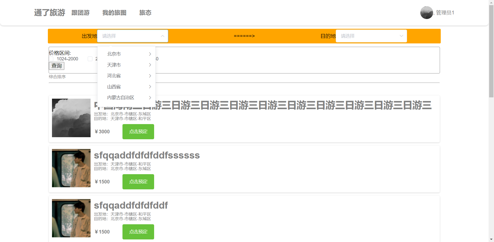
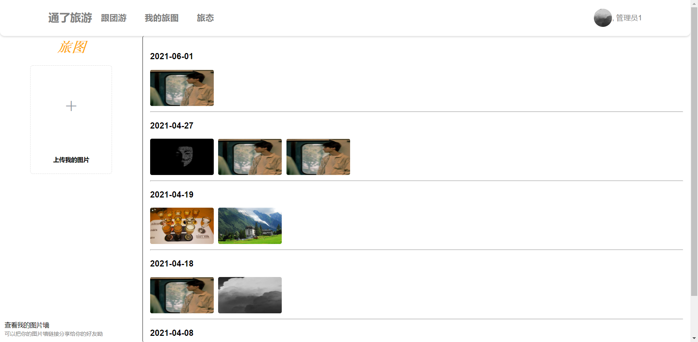
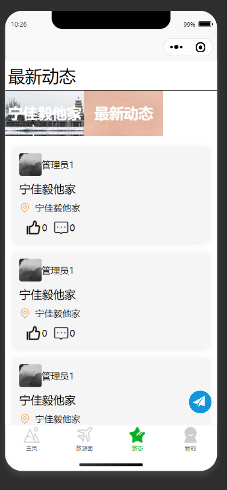

# tourism
旅游项目，有web端，app端，微信小程序端。

分登录，旅游团信息，旅图，旅游动态这几个板块（微服务）；

权限分管理员和普通用户。

因为主要是面向c端的项目所以没有提供管理员的注册及相关账号功能

## 技术栈：

前端：

- vue
- element ui
- 飞冰
- uniapp
- 还有很多前端插件,就不一一说了，大家可以看package.json

后端：

 - springboot
 - springCloud(openfeign+gateway)
 - springCloudAlibaba(nacos+setinel+seata)
 - mysql+redis(消息队列及时效性数据使用redis)
 - easyexcel
 - mail
 - fastDfs
 - 等等

## 概览：

## 界面图

#### pc

主页

登录

注册：

忘记密码：

修改信息：

旅游团

旅游团详细信息

旅图

照片墙：

动态：

发布动态：

 后台-旅游团信息发布

后台：动态信息管理

后台：旅游团信息管理

后台：预定用户手机号查看

后台：首页展示信息管理

后台：通知管理

#### 手机端

微信小程序测试平台为 “微信开发者工具”

app测试平台为：“逍遥模拟器”

展示：

具体页面的名称我就我介绍了，大家可以自行观看

app端页面样式和小程序端相同，我就不截图展示了，大家可以自行下载源码查看

